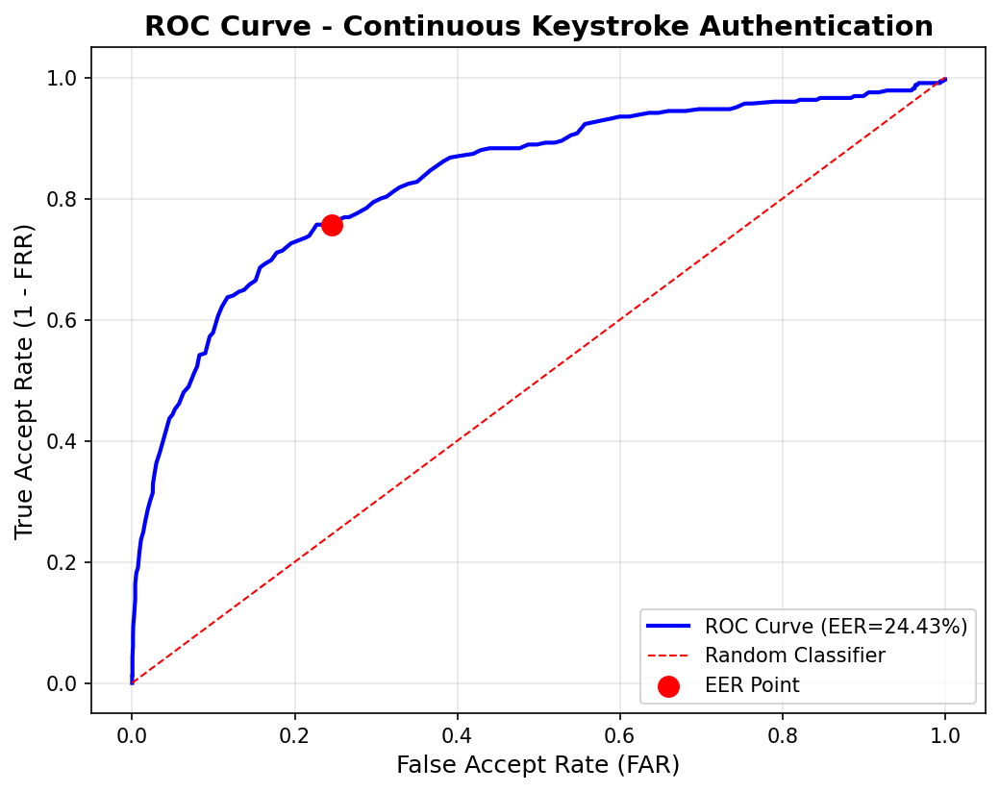
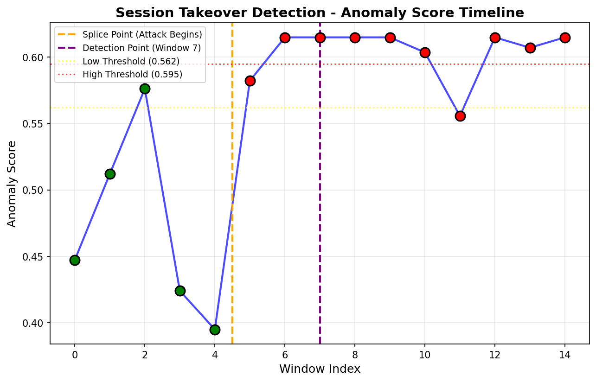

# Continuous Keystroke Authentication

Real-time session hijacking detection using typing rhythm and unsupervised machine learning — extending published keystroke-dynamics research from login-only verification to continuous, in-session monitoring.

[](https://github.com/vaishnavipratha7/continous-keystroke-auth/actions/workflows/tests.yml)

---

## The Problem

Most authentication happens once, at login. [Martins et al. (2025)](https://doi.org/10.1007/s42452-025-07449-5) demonstrate that typing rhythm — how long you hold keys, the pauses between them — can identify a user with ~80% accuracy using supervised classifiers (KNN, Random Forest, LightGBM). But their approach only verifies identity at the point of login, and requires labeled examples of "impostor" typing to train on — data that's impractical to collect for every real user.

If someone gets past login (a stolen session, an unattended unlocked machine), nothing catches them.

## The Approach

This project builds a **continuous** verification layer on top of that gap. This mirrors commercial continuous-authentication products (e.g., BioCatch, TypingDNA) used for shared-workstation and account-takeover detection, implemented here at prototype scale on a public research dataset.

- **Per-user, unsupervised models** — each user gets their own Isolation Forest, trained only on *their own* enrollment typing. No impostor data required, unlike the original supervised approach.
- **Windowed monitoring** — typing is split into 50-keystroke windows, each scored against the user's personal baseline in real time throughout the session, not just at login.
- **Smoothed risk decisions** — a session is only flagged after 3 consecutive medium/high-risk windows, so a single tired or distracted moment doesn't trigger a false lockout.
- **Step-up verification (MFA)** — instead of an instant hard lockout, sustained anomalies first prompt a PIN challenge, giving a legitimate user with naturally shifting typing a chance to confirm identity before the session is terminated. This production-realistic UX pattern handles false positives gracefully without immediate session termination.
- **Adaptive learning** — a session confirmed safe on completion feeds back into the user's model, letting the baseline evolve with natural drift over time.
- **Explainability** — every flagged window comes with a SHAP-based explanation of which specific behavioral feature (typing speed, key-hold time, inter-key timing) drove the anomaly score.

## Features

- **Per-User Unsupervised Learning**: Each user gets their own Isolation Forest model trained only on their typing data
- **Real-Time Continuous Monitoring**: Every 50 keystrokes analyzed throughout active sessions
- **Consecutive Risk Smoothing**: 2 consecutive medium/high windows → MFA challenge, 3+ → session termination
- **Step-Up Authentication**: PIN-based MFA with bcrypt hashing and rate limiting (5 attempts max)
- **Adaptive Learning**: Safe sessions retrain the model to accommodate natural behavioral drift
- **SHAP Explainability**: Feature-level explanations for anomalous predictions
- **Production-Ready Architecture**:
  - Session history with comprehensive audit trails
  - Dashboard analytics (session counts, risk ratios, model training stats)
  - Database optimization (dedicated session summaries collection)
  - RESTful API design with JWT authentication

## Results

Validated on the [KeyRecs](https://doi.org/10.1007/s00521-022-07472-0) free-text dataset (562K+ real keystroke events, 100 participants):

| Metric | Result |
|---|---|
| Equal Error Rate (EER) | 24.43% |
| Model comparison | IsolationForest (24.43% EER) outperformed OneClassSVM (31.86% EER) |
| Takeover detection lag | 2 windows (~100 keystrokes) after a real participant handoff |
| Window size | 50 digraphs (tuned against 30-digraph alternative: 26.05% EER) |

<div align="center">
  
  
</div>

*Left: ROC curve across decision thresholds. Right: live anomaly score during a simulated takeover — two real participants' recorded typing spliced together. Orange marks where the attacker's typing begins; purple marks where the system locks the session.*

## Architecture

```
┌─────────────────────────────────────────────────────────────────┐
│                         FRONTEND (React)                        │
│  Enrollment • Live session dashboard • History • SHAP explainer │
└────────────────────────┬────────────────────────────────────────┘
                          │ HTTP/JSON
┌─────────────────────────▼───────────────────────────────────────┐
│                      BACKEND (FastAPI)                          │
│  Auth (bcrypt + tokens) • ML pipeline • MongoDB persistence     │
└─────────────────────────┬───────────────────────────────────────┘
                          │
┌─────────────────────────▼───────────────────────────────────────┐
│  KeyRecs Dataset → Digraph Extraction → Windowing → Per-user     │
│  Isolation Forest → Risk Scoring → SHAP Explanation              │
└─────────────────────────────────────────────────────────────────┘
```

**Stack**: React · FastAPI · MongoDB · scikit-learn (IsolationForest) · SHAP · pytest

## Setup

**Prerequisites**: Python 3.10+, Node 18+, MongoDB running locally.

```bash
git clone https://github.com/vaishnavipratha7/continous-keystroke-auth
cd continous-keystroke-auth

# 1. Get the dataset and build features
python scripts/download_data.py
python scripts/parse_dataset.py

# 2. Backend
cd backend
pip install -r requirements.txt
python main.py

# 3. Frontend (new terminal)
cd frontend
npm install
npm run dev
```

Open `http://localhost:5173` — sign up, enroll by typing the passage (~150 keystrokes for quick demo), then watch the live risk dashboard. Use the "Simulate Shared-Workstation Handoff" button to demonstrate detection.

**Quick Start Script** (Windows):
```powershell
.\START_ALL.ps1  # Starts MongoDB, backend, and frontend automatically
```

## Reproducing the Results

```bash
python scripts/run_validation.py
```

Regenerates `scripts/validation_report.txt` and the two figures above from scratch — including the window-size comparison and the IsolationForest vs. OneClassSVM comparison.

## Testing

```bash
cd backend
pytest tests/ -v          # unit tests on the ML pipeline
```

```bash
python scripts/test_e2e.py   # full live flow: signup → enroll → session → attack → detection → SHAP
```

## What This Project Deliberately Does *Not* Claim

- **24.43% EER is prototype-scale accuracy**: Not production-ready without additional behavioral signals (mouse dynamics, device fingerprinting, application context).
- **Synthetic attack button is UI demonstration**: The real validation evidence is the splice test in `scripts/run_validation.py` using actual participant data.
- **Limited evaluation scope**: 10 participants, single dataset, one takeover scenario. Larger evaluation needed for production claims.
- **Adaptive learning can be poisoned**: The bounded-history mechanism reduces risk but doesn't provide complete protection against adversarial model poisoning.
- **Academic research prototype**: Extends published work for learning purposes; not load-tested, penetration-tested, or deployed at scale.

## Project Structure

```
continuous-keystroke-auth/
├── backend/
│   ├── main.py              # FastAPI application with all endpoints
│   ├── pipeline.py          # ML pipeline (digraph extraction, windowing, Isolation Forest)
│   ├── auth.py              # Authentication (bcrypt, JWT tokens, PIN verification)
│   ├── db.py                # MongoDB connection and collections
│   └── tests/               # Unit tests for ML pipeline
├── frontend/
│   └── src/
│       └── App.jsx          # React app (enrollment, session monitoring, history, dashboard)
├── scripts/
│   ├── download_data.py     # Download KeyRecs dataset from Zenodo
│   ├── parse_dataset.py     # Reconstruct keystroke events from sessions
│   ├── run_validation.py    # Full validation: EER, ROC, takeover simulation
│   └── test_e2e.py          # End-to-end integration test
├── data/                    # KeyRecs CSV files (gitignored)
├── docs/figures/            # Generated ROC and takeover detection charts
└── START_ALL.ps1            # Quick-start script (Windows)
```

## Future Work

- Evaluate on larger, more diverse user populations
- Incorporate multimodal signals (mouse dynamics, application behavior)
- Implement poison-resistant adaptive learning mechanisms
- Conduct formal security audit and penetration testing
- Study threshold calibration strategies
- Address privacy considerations and compliance requirements

## License

MIT License - See LICENSE file for details.

## Citation

This project extends the methodology from:

Martins, J.P., Soares, S.C., Pinho, A.J., et al. (2025). Keystroke dynamics for intelligent biometric authentication with machine learning. *Discover Applied Sciences*, 7(34). https://doi.org/10.1007/s42452-025-07449-5

Dataset: Bours, P., & Mondal, S. (2023). A dataset for exploring user authentication through free-text keystroke dynamics. *Neural Computing and Applications*, 35, 16077–16093.


